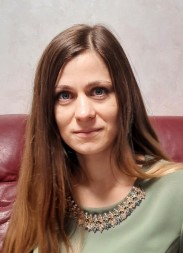

#Olena Semerei



##Contacts
* Phone: +380673345037
* Email: elenasemerei@gmail.com
* Telegram:@elenasemerei
* Github: olenasemerei
* Discord: @OlenaS#2639

##About me
II am a student of RS School. I have a strong desire to learn programming. I want to have high level of JavaScript. I am interesting in creating applications.I want to be useful to people.

##Skills
* HTML5
* CSS3
* Javascript (in training)
* VS Code
* GiHub
* Figma

##Code example

``` 
const O = '0';
const EMPTY = '';

const game = {
board: [
[EMPTY, EMPTY, EMPTY],
[EMPTY, EMPTY, EMPTY],
[EMPTY, EMPTY, EMPTY],
],
currentUser: X,
step(rowIndex, cellIndex) {
const { currentUser, board } = this;
``` 

##Courses
* 2021 - course JS/FE Pre-School 2022(in progress)
* 2021 - course HTML/CSS "Html-2021-11 OWU"
* 2021 - course MGI "English as a second language"
* 2020 - course GoIt "HTML, CSS, JavaScript Pre-Course"

##Projects
 * [CV for GoIt] [https://nervous-lalande-094bb5.netlify.app/ "CV for GoIt"]
 
##Experience
* 2021 - Marathon GoIT TestDrive

##Education
 * 2001-2006 Lutsk National Technical University Master of Economics
 
##Languages

* English - B1+
* Russian - native
* Ukrainian - native
